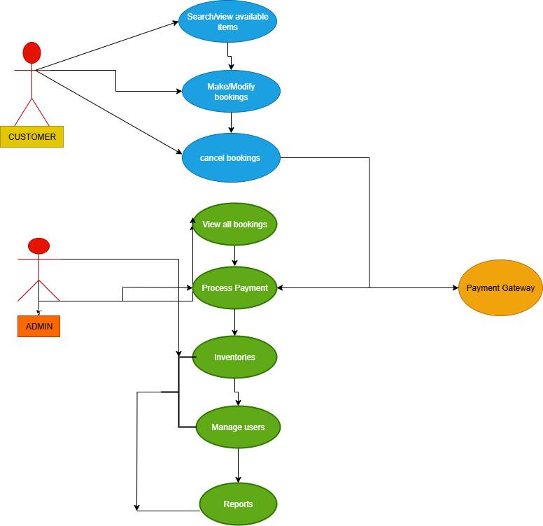

# Airbnb Clone Backend Features and Functionalities

This document provides an overview of the core features and functionalities required for the Airbnb Clone backend.

## **Key Features**
1. **User Authentication**
   - Sign up, Login, Password Reset
2. **Property Management**
   - Add, Edit, Delete Listings
3. **Booking System**
   - Create, Cancel, View Bookings
4. **Payments**
   - Stripe Integration, Refunds
5. **Reviews & Ratings**
   - Leave Reviews, Rate Hosts & Guests

## **Diagram**

